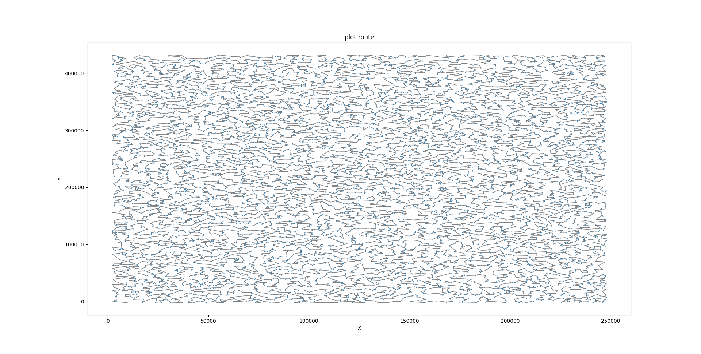

# PCB-Drill-Path-Optimizer 


本專案針對大型的 PCB 版面設計，採用結合 `greedy` 和 `2-opt` 的策略，專門優化上萬座標點的鐳射鑽孔路徑，並於實際應用到鐳射機台當中。

## 🌟 項目背景

隨著電子技術的進步，PCB 版面越來越大、元件擺放的密度越來越密集。對於大型的 PCB 版面，座標點數量常常達到上萬點甚至更多。面對這麼龐大的數據，傳統的啟發式演算法難以在短時間內給出合理解答。本專案所開發的 `greedy + 2-opt` 算法，不僅能在更短的時間內給出解，而且提供了更加合理的鑽孔路徑。

## ✨ 技術亮點

- **高效的算法**：結合了`greedy`策略和`2-opt`策略，有效地找到近似最佳的路徑。
- **numpy 優化**：全面採用 numpy 進行資料結構的改寫和高效數學運算，確保計算速度。
- **智能2-opt選擇**：優先選擇能大幅改善路徑長度的線段進行2-opt操作，進一步加速算法的收斂過程。


## 🚀 使用方法
1. **安裝依賴**:
\```bash
pip install numpy pandas scipy matplotlib tqdm icecream
\```
2. 運行主程式：
\```bash
python main.py
\```
## 📖 使用範例(使用coords_df.csv當作範例)

\```bash
python main.py
\```
## 🖼️ 優化結果展示

基於保護公司機密，我們無法公開真實的PCB路徑。但為了展示本專案的效能，以下展示的是一組模擬資料，其規模與實際應用情境相似，包含了約1萬點的鑽孔路徑：

## 📞聯絡方式
- 電子郵件：hungcheng.chen@outlook.com
